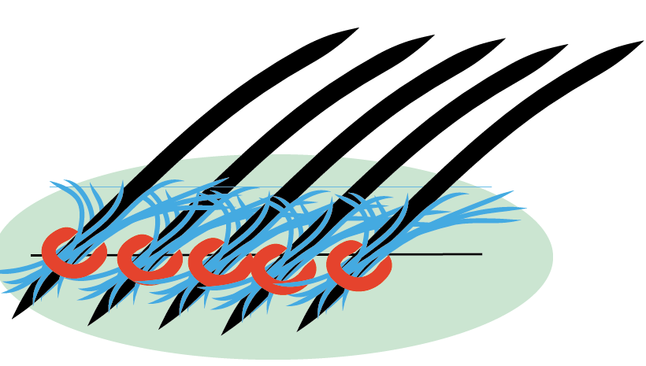

Formation toiletteur canin
==========================

Tout ce qu'il faut savoir sur le sujet !
-----------------------------------------

**Formation toiletteur canin : quelles formations en toilettage ? Quels
programmes ? Quelles méthodes ? Quels sont les points essentiels à
observer ?**

[Formation toiletteur canin : pour quel « métier » ?](/docs/formation-toiletteur-canin/#metier)
---------------------------------------------------

Pour bien répondre aux questions ci--dessus, ne pensez-vous pas qu'il
faille commencer par définir de quoi l'on parle, lorsque l'on parle de
toilettage ?

Toiletteur : de quoi parle-t-on ? Vous allez voir, cela mérite d'être
défini !

Disons cependant, en préalable, que le marché du toilettage a énormément
changé au cours des trente dernières années.

Les chiens ont changé. Les attentes des propriétaires ont changé. Le
travail des salons de toilettage a donc, lui aussi, beaucoup changé.

### Le toilettage hier

Vous le savez, les (nombreuses) races de chiens se différencient aussi
par leur pelage.

Celui-ci peut être ras, voire inexistant, court, mi-long, long ou même
très long.

Les toiletteurs d'hier distinguaient ce qu'ils appelaient les races
« toilettables », des autres, dites par opposition non toilettables.

On disait toilettables les chiens dont l'aspect extérieur se trouvait
modifié, un peu ou beaucoup, par le toilettage.

Cette modification obtenue par tonte, coupe aux ciseaux ou encore par
épilation.

### Peu de races, mais suffisamment de sujets

En réalité, les races des chiens dont l'aspect extérieur se modifie par
le toilettage sont tout à fait minoritaires par rapport aux autres : de
l'ordre de la vingtaine environ.

Cela signifie que si le travail du toilettage se limite strictement à la
modification des fourrures, les races de chiens concernées par le
toilettage sont très peu nombreuses.

Mais pour les toiletteurs français, hier, cela ne constituait pas
réellement un problème : en effet, pendant très longtemps, **plus de la
moitié des chiens français ont été des caniches ou des chiens genre
caniche** ! Avec en corollaire une opinion (fausse) partagée par
l'immense majorité des propriétaires de caniches : le poil des caniches
pousserait en permanence. Et nécessite par conséquent des tontes ou des
coupes à intervalles réguliers.

Cela avait fait naître une profession de « tondeurs », prédécesseurs des
toiletteurs.

### Le toilettage à l'étranger

Cette prédominance du caniche aura été un phénomène strictement limité à
notre pays.

Dans les autres pays, ce qui a conduit à l'apparition d'une offre de
service en toilettage n'a pas été prioritairement une demande de
raccourcissement des pelages. Offre aurait de toute façon insuffisante
pour faire naître une profession.

À quoi prétendait donc répondre l'offre, dans ces autres pays ?
**Prioritairement à une demande d'hygiène.**

### Formation toiletteur canin et évolution du goût du public

Peu à peu, partout et donc y compris dans notre pays, la recherche du
naturel est apparue, pour finalement s'imposer. Au détriment d'abord de
la race caniche, devenue presque confidentielle aujourd'hui.

En effet, les éleveurs de cette race ont refusé d'évoluer, et continuent
de présenter en concours des toilettages sophistiqués en complet
décalage avec le goût du public moderne.

D'une façon générale, le public n'apprécie les coupes et épilations que
si ces dernières restent « invisibles » : le chien toiletté doit
paraître aussi naturel que possible.

Mais la préférence vers des races sans toilettage, à poil court ou long,
semble aller en croissant.

C'est dire qu'aujourd'hui, pour un toiletteur, se limiter aux tontes,
coupes, ou épilations, est devenu parfaitement irréaliste.

Formation toiletteur canin canin : le caniche, plus tellement au goût du
jour !

### Formation toiletteur canin et évolution de l'offre en France

Quasi-disparition des caniches, stagnation des autres races
« toilettables », le marché a bien dû s'adapter, sous peine, donc, de
disparaître.

Une première voie a été d'inviter le public à raccourcir des fourrures
pour lesquelles le standard de la race ne le prévoyait pas.

L'exemple le plus significatif est celui du bichon frisé. Normalement,
le bichon frisé devrait conserver son poil long. Il est aujourd'hui très
souvent raccourci.

C'est le cas également de nombre d'autres bichons, et même de quelques
autres races...

Le problème, c'est que du point de vue strictement cynotechnique, comme
de celui de la zoocosmétologie, c'est une très mauvaise idée.

La zoocosmétologie : la science des soins au pelage, visant au meilleur
confort et à la protection de la santé des animaux.

Or la zoocosmétologie enseigne que l'animal a besoin de son pelage, et
que couper du pelage, c'est lui nuire.

Peu à peu, le public s'en rend compte, s'en rendra plus encore compte
demain. Les coupes apparaissent de plus en plus pour ce qu'elles sont en
effet : une forme d'impasse.

### La voie de l'hygiène

On rencontre une très forte évolution de la manière de vivre de nos
contemporains avec leurs animaux de compagnie.

Désormais, le chien vit le plus souvent à l'intérieur de la demeure de
ses maîtres, quand ce n'est pas dans leur chambre...

On est donc très loin de l'époque du chien confiné dans un chenil à
l'extérieur de la maison.

Or, cette nouvelle manière de cohabitation a une conséquence évidente
que l'on devine : une demande toujours plus forte d'hygiène.

Et donc en fait un nouveau marché, une véritable opportunité, pour les
entreprises de toilettage.

Avec de formidables perspectives : désormais, le potentiel de la
clientèle ne se limite plus à quelques races, il s'élargit à...
l'ensemble de la population canine !

### Les contraintes techniques

Si vous avez la curiosité de visiter des salons de toilettage à
l'étranger, vous ne manquerez pas d'être surpris par ceci : le nombre de
chiens sur lesquels on ne pratiquera que de l'hygiène ! Coupe des
ongles, soins divers, et bain. Un nombre très supérieur à ce qui se
pratique dans notre pays !

Maintenant, si vous allez regarder du côté des tarifs, vous allez vite
comprendre l'origine de cette distorsion ! Le plus souvent, les prix
demandés en France pour les soins d'hygiène sont beaucoup plus élevés !
En fait, ils sont tout simplement trop élevés, ce qui freine le
développement de ce marché.

Pourquoi des prix trop élevés ? Il y a plusieurs raisons à cela. Mais
l'une d'entre elles est strictement technique. Au contraire de
l'intuition que l'on pourrait en avoir, le bain, cela n'est pas aussi
simple qu'il y paraît d'abord ! Cela demande au contraire un
savoir--faire, une excellente gestuelle, et pour finir des installations
et équipements spécifiques et adaptés.

Si les toiletteurs ne le font pas, d'autres le feront à leur place. Les
vétérinaires, les grandes surfaces. Et le problème, c'est que c'est déjà
un peu ce qui se passe.

Conclusion : une formation cohérente devra faire une place essentielle à
l'ergonomie de l'hygiène. Comment optimiser la productivité de cette
activité, et pouvoir offrir au marché des prix acceptables ?

Ou dit plus clairement : comment gagner de l'argent par des services
d'hygiène ?

Une réponse qui mérite une très sérieuse préparation.

### Formation toilettage canin : la recherche d'autres débouchés

Existe-t-il pour les toiletteurs professionnels d'autres « débouchés » ?

Oui. Par exemple la demande en toilettage pour le chat est en constante
évolution. Cela peut représenter une vraie opportunité, car les salons
qui acceptent les chats ne sont pas si nombreux.

Les chats, et notamment les chats à poil long sont de plus en plus
souvent préférés aux chiens.

On notera qu'un chat à poil long nécessite un entretien régulier. Un
entretien qui n'est pas à la portée de tous les propriétaires. Manque
d'habileté, mais aussi souvent manque de temps.

Et, de manière presque inexorable, chez le chat, un poil long non
entretenu finit par former des tapons rapidement indémêlables. Quand on
est arrivé à cette extrémité, un seul remède : la tonte. Une opération
tout à fait hors de portée des propriétaires...

Pour éviter ces inconvénients, un entretien régulier n'est pas
suffisant, des bains réguliers sont également nécessaires. Des bains qui
apporteront à leur tour de sérieux bienfaits aux chats à poil court, de
plus en plus souvent confinés en appartement !

Des chats, on glisse facilement vers ce que l'on appelle les Nouveaux
Animaux de Compagnie (NAC) : lapins nains, cobayes, furets... Proposez
vos services à leurs propriétaires, vous serez surpris de l'importance
de la demande !

Formation toiletteur canin : le chat, les NAC, des sujets qu'il faudra
impérativement aborder, théorie et pratique !

[Formation toilettage canin : généralités](/docs/formation-toiletteur-canin/#general)
----------------------------------------

Une formation en toilettage canin doit vous permettre d'entrer dans les
meilleures conditions dans la profession.

Vous devrez en effet parvenir à combiner deux impératifs, en apparence
(mais en apparence seulement) opposés.

-   Le premier impératif vient de vous : vous voulez (bien) gagner votre
    vie. Et vous avez raison.

-   Le second vient de votre clientèle : cette dernière ne veut (ou ne
    peut) pas supporter des prix élevés.

Pour concilier ces deux impératifs, une seule solution : travailler sa
productivité ! Il ne s'agit pas seulement de proposer un travail de
qualité. **Il faut surtout proposer un travail de qualité maximale,
réalisé en un temps minimal.**

Cela passe bien sûr par un excellent contact avec les animaux : ces
derniers doivent se laisser facilement et agréablement manipuler par
vous. Nous y reviendrons.

Mais cela passe avant tout par une approche résolument ergonomique de
travail de toilettage !

Voyons cela dans le détail.

[Formation toilettage canin et ergonomie](/docs/formation-toiletteur-canin/#ergonomie)
---------------------------------------

On peut définir l'ergonomie comme l'étude des gestes, des outils et des
conditions de travail, en vue de l'amélioration de leur productivité.

Travailler plus vite, plus sûrement, en économisant autant que possible
son effort, tout cela pour un résultat de qualité supérieure : voilà ce
qu'on pourrait définir comme une recherche scientifique ergonomique du
toilettage.

### Ergonomie, pourquoi ?

Sans une excellente connaissance de l'ergonomie du toilettage, vous ne
serez pas en mesure de proposer à votre clientèle des travaux de qualité
acceptable ou supérieure à des prix compétitifs.

### Ergonomie : bien comprendre le problème

Incontestable : certains toiletteurs gagnent très bien leur vie.

Pendant le même temps, d'autres ne cessent de se plaindre : les prix
sont trop bas, le travail est trop fatigant, pas assez récompensé...

Quelle est la différence entre les premiers et les seconds ?

Ne cherchez pas ! Les premiers ont procédé à une étude rigoureuse de
l'ergonomie de leur travail. Ce qui n'est bien sûr pas le cas des
autres.

L'ergonomie du toilettage, ce sont d'abord des gestes sûrs et précis.

Cela vaut pour la prise en main des animaux, comme pour l'utilisation
des différents outils.

Sans oublier, bien sûr, l'organisation du poste de travail et les
installations.

### Formation toiletteur canin : apprendre l'ergonomie, comment ? {#formation-toilettage-canin-apprendre-lergonomie-comment}

Une seule façon d'apprendre : étudier par le détail chaque geste, puis
s'y exercer par la répétition d'exercices progressifs.

Que cela plaise ou non, le toiletteur a quelque chose de commun avec le
sportif ou le musicien. Il y a des gestes qu'il faut apprendre et
répéter, pour se les approprier. C'est la condition pour demain
travailler vite, bien et en ménageant sa peine. Tout en gagnant (bien,
voire très bien) sa vie.

Il s'agira par conséquent pour l'essentiel d'un travail individuel et
personnel, à partir d'un guide précis et complet.

En effet, la seule imitation de professionnels, même particulièrement
compétents, est totalement insuffisante.

Vous n'apprenez pas à jouer du piano ou à pratiquer le judo en observant
les pianistes ou les judokas.

Une formation sérieuse devra prendre en compte pour une large part,
sinon pour une part essentielle, cet apprentissage ergonomique de tous
les gestes.

Sans cette formation, vous pourrez certes devenir un toiletteur
susceptible de produire des travaux d'une finition acceptable. Mais vous
prenez trois risques, qui peuvent d'ailleurs se combiner entre eux, et
qui se révéleront particulièrement dommageables :

-   le risque de ne pas aller assez vite, et donc de ne pas être
    compétitif au plan économique,

-   le risque de pas travailler dans des conditions suffisantes de
    sécurité, pour vous comme pour les animaux,

-   le risque de pas atteindre un niveau suffisant et suffisamment
    régulier de qualité.

Formation toilettage canin : Une formation sérieuse devra prendre en
compte pour une large part, sinon pour une part essentielle, cet
apprentissage ergonomique de tous les gestes.

### Les bons outils du toilettage, manière ergonomique de s'en servir

Vous devrez apprendre à distinguer les bons outils des mauvais, qui sont
pléthores sur le marché. Et pour les bons outils, vous devrez apprendre
à les utiliser de manière optimale.

Vous devrez aussi apprendre à choisir les éléments constitutifs d'un
poste de travail optimisé du point de vue de l'ergonomie.

[Formation toilettage canin et Zoocosmétologie](/docs/formation-toiletteur-canin/#zoocosmetologie)
---------------------------------------------

### Physiologie de la peau et du pelage

À l'issue d'une formation, les fonctions de la peau et du pelage, leur
physiologie, n'auront évidemment plus de secrets pour vous.

Vous comprendrez en particulier les règles régissant la kératine, ce
constituant principal des pelages (comme des cheveux...).

Formation toilettage canin : à l'issue de la formation, les fonctions de
la peau et du pelage...

### Principaux modes d'action des produits, shampooings, crèmes, autres...

Pourquoi et comment les shampooings ont-ils un effet détergent ? Dans
quelles conditions ?

Quel est le rôle des crèmes, des autres produits ? Comment les
distinguer ? Quels sont les avantages et les inconvénients respectifs de
chacun d'entre eux ?

Comment comprendre et classer les additifs que l'on rencontre dans les
produits de toilettage ? Quels sont ceux qu'il faut préférer, ceux qu'il
ne faut jamais utiliser ?

### Formation toilettage canin : l'eau, les qualités de l'eau, les tensioactifs

Comprendre comment l'eau agit sur un pelage, sur la kératine. Savoir ce
qu'est un tensioactif.

Connaître et comprendre le rôle des tensioactifs présents dans l'eau, et
apprendre à combattre leurs effets négatifs.

Connaître et comprendre les qualités de l'eau : pH, dureté. Connaître
l'effet de ces caractéristiques sur le pelage et donc sur le toilettage.

### Les airs

Connaître et comprendre les différences fondamentales entre les modes
d'action des airs à haute et à basse pression ; apprendre à optimiser
son travail par l'utilisation rationnelle et complémentaire de ces airs.

[Formation toiletteur canin et cynophilie](/docs/formation-toiletteur-canin/#cynophilie)
-----------------------------------------

### Connaissance des standards de race et des patrons de toilettage

Le toiletteur a une bonne connaissance des principaux standards de race,
mais surtout, il sait adapter les exigences d'un standard à son travail
de toilettage.

Plus important : il sait que les différents pelages se regroupent autour
**d'une petite douzaine de « patrons »**. Des patrons dont il connaît
bien les principales caractéristiques. Il sait comment il faut adapter
son travail de toilettage à chacun de ses patrons.

Il sait rattacher sans se tromper, n'importe quel standard de race à son
« patron » !

La connaissance des « patrons » est donc plus importante pour le
toiletteur et même beaucoup plus importante, que celle des standards.

(Elle est pourtant trop souvent ignorée tant de certains programmes de
formation et que de nombre de toiletteurs !)

### Organisation de la cynophilie en France et dans le monde

C'est l'évidence, une pratique rationnelle du toilettage impose de
comprendre pourquoi et comment il existe des concours visant à
l'amélioration des races canines. Savoir distinguer les concours de
beauté des concours de travail, être capable de participer à la
préparation d'un chien à un concours de beauté...

Même s'il ne se destine pas à ce type de spécialisation, le toiletteur
se doit d'être au moins initié aux règles et à la pratique du handling
(préparation et présentation d'un sujet à un concours de beauté).

### Connaissance du chien et du chat

Une formation toilettage canin abordera bien sûr des questions telles
que

-   \- le classement des races par groupes,
-   \- les origines du chien et du chat,
-   \- une approche éthologique de l'espèce canine et de l'espèce
    féline.
-   \- la génétique appliquée aux chiens et aux chats
-   \- les principales pathologies chez le chien et le chat.

La formation toilettage canin abordera, c'est l'évidence l'anatomie et
la biologie du chien et du chat. Les \"régions\", notions indispensables
pour décrire et comprendre les standards, devront être parfaitement
maîtrisées.

[Formation toiletteur canin et esthétique](/docs/formation-toiletteur-canin/#esthetique)
----------------------------------------

Une évidence : le toilettage est un travail esthétique.

Sans un sens aigu de l'esthétique, de l'harmonie des lignes, de
l'équilibre et de la balance des formes, impossible de réussir un beau
toilettage.

Cet apprentissage passe par celui du dessin : l'apprenti toiletteur doit
être capable d'esquisser à main levée le schéma des principaux standards
de toilettage. En effet, l'expérience montre que la réussite d'un beau
toilettage impose l'acquisition préalable de cette capacité.

[Formation toiletteur canin : gestion et administration d'un lieu de production de toilettage](/docs/formation-toiletteur-canin/#gestion)
--------------------------------------------------------------------------------------------

Est-il réellement nécessaire d'y insister ? Le travail du toilettage
s'inscrit dans un univers professionnel et commercial.

La formation devra donc aborder l'environnement économique et juridique
de l'activité, sa réglementation, ainsi que la réglementation des
activités connexes ou annexes telles que l'élevage, ou encore
l'éducation...

La préparation à l'activité commerciale comprendra une initiation à la
vente des produits et des services.

[Formation toiletteur canin : étude du comportement animal](/docs/formation-toiletteur-canin/#comportement)
---------------------------------------------------------

Bien entendu, le toiletteur n'est pas un comportementaliste.

Pour autant, une bonne connaissance du comportement du chien et chat lui
est parfaitement nécessaire.

Cette connaissance lui permettra d'anticiper les réactions des animaux
et d'adapter son propre comportement. Cette compréhension et cette
adaptation vont conduire à une meilleure communication avec l'animal. Ce
dernier se trouve ainsi mis en confiance, rassuré, et plus facilement
disposé à bien accepter, voire à apprécier le toilettage.

Formation toilettage canin et comportement : ouvrir les portes d'un
véritable « toilettage comportemental ».

Attention, cette formation au comportement ne doit pas être seulement
théorique. Pour être complète, elle doit être complétée par
l'apprentissage de gestes techniques, démontrés et répétés dans le cadre
d'un apprentissage gestuel global.

Cet apprentissage sera contrôlé et validé par des formateurs initiés au
toilettage comportemental. Le seul moyen d'éviter les risques d'une
gestuelle imparfaitement comprise.

Dans ce cadre seront traités les gestes et techniques permettant la
maîtrise et le contrôle du chien et du chat.

Un apprentissage qui permet ensuite de travailler mieux, plus sûrement,
mais surtout, avec plus de plaisir. L'animal qui fait confiance à son
toiletteur est pour ce dernier une grande source de satisfaction.

[Formation toiletteur canin et pratique du toilettage](/docs/formation-toiletteur-canin/#pratique)
----------------------------------------------------

Le travail pratique aura été préparé par l'étude de la gestuelle des
actes. Il permettra d'aborder toutes les phases d'une action de
toilettage.

Il sera l'occasion d'une observation approfondie et critique des outils
et des installations en salon de toilettage.

Il permettra aussi d'aborder les sujets connexes comme l'organisation
pratique d'une production, la maintenance des locaux et du matériel.

Cette formation pratique peut difficilement s'envisager dans le seul
cadre de « stages pratiques ».

Idéalement, elle doit venir en complément d'une initiation rigoureuse
dans **un lieu de formation dédié, un atelier de toilettage ou un
salon-école**.

Un salon de toilettage, même s'il accepte des stagiaires, est d'abord
occupé par sa production. Ce qui compte pour lui, c'est le nombre de
chiens toilettés et la qualité de ses toilettages. Un salon de
toilettage montrera donc toujours beaucoup de répugnance à laisser
s'exercer les stagiaires sur les chiens de sa clientèle !

Un vrai lieu-école est un lieu où l'on toilette des chiens, certes, mais
sans que ce lieu ait un réel objectif de production.

Un lieu de formation animé par des formateurs strictement dédiés à la
formation des élèves et des stagiaires, des formateurs eux-mêmes sans
objectif de production.

[Formation toiletteur canin : quel centre de formation ?](/docs/formation-toiletteur-canin/#centre-formation)
-------------------------------------------------------

Beaucoup de solutions peuvent se présenter. Essayons un inventaire.

### Formation toiletteur canin : la formation proposée par les salons de toilettage

Certains salons prétendent offrir en plus du service de toilettage, une
offre de formation.

Les inconvénients d'une telle solution sont nombreux. Cela commence par
l'absence de formation théorique. La formation pratique laissera
elle-même beaucoup à désirer, pour des raisons déjà explicitées
ci-dessus : l'objectif réel d'une entreprise de toilettage est la
production de toilettage et non la formation.

On notera d'ailleurs qu'une formation en salon de toilettage ne peut
jamais être reconnue, et donc faire l'objet d'un financement public.

### Formation toiletteur canin : les centres de formation à distance

Ils sont devenus en quelques années de véritables poids lourds du marché
de la formation. Aidés en cela par une politique de marketing
informatique à très gros budgets. Ils offrent désormais des formations
dans un nombre incroyable de domaines, le toilettage, bien sûr, ne
faisant pas exception.

C'est ici l'opposé de la solution précédente : la formation est
exclusivement théorique.

Ce qui n'est pas impossible en toilettage pour certaines personnes. Mais
bien entendu, un moyen de formation inadapté pour le plus grand nombre.
Les personnes susceptibles d'apprendre le toilettage uniquement par
correspondance sont en effet des exceptions.

Certes, on vous recommandera des stages pratiques. Mais un stage est un
moment pour mettre en pratique des savoirs préalablement acquis. En
aucun cas un lieu pour un premier apprentissage. Le lieu de stage n'a en
général ni le temps, ni les compétences, pour assurer une mission de
formation. Et encore moins les moyens techniques.

### Formation toiletteur canin : les centres de formation d'apprentis

Ces centres présentent de nombreux avantages. Il y a bien une formation
théorique. Par ailleurs, ils comportent un lieu de formation dédié au
toilettage, sans objectif de production.

Ces centres ont souvent une offre pour les adultes.

Le seul point à vérifier est que la formation proposée correspondra
réellement au type de toilettage que vous voudrez pratiquer plus tard.

### Formation toiletteur canin : les centres de formation pour adultes

il existe plusieurs centres de formation pour adultes. À vous, avant de
vous inscrire, de bien vous renseigner sur le programme de formation !
Et, là encore, de vous assurer que ce programme correspond à vos
attentes.

Observez la réalité d'une indispensable formation théorique.

Et vérifiez qu'il s'agit bien d'un lieu de formation sans objectif de
production ! Et non d'un salon de toilettage maquillé en centre de
formation !

### Formation toiletteur canin : les formations proposant un « mix », moyens numériques et atelier de formation pratique

On nous pardonnera de penser qu'il s'agit d'une solution adaptée à de
nombreux cas, puisque c'est celle que nous avons choisie pour notre
organisme.

L'avantage des moyens numériques est qu'ils permettent à chacun de
choisir moments, durées et lieux de formation à sa convenance.

Les apprentissages théoriques utilisent prioritairement cette voie.

C'est aussi le cas, au moins pour partie, de certaines initiations
pratiques : démonstration minutieuse d'exercices gestuels progressifs à
répéter individuellement.

Une préparation à l'apprentissage pratique dans l'atelier de formation,
ou dans des salons de toilettage partenaires, rémunérés pour leur
travail de formation.

L'atelier de formation devenant un passage fortement recommandé, sinon
obligé, du parcours de formation. Il en est véritablement le pivot
central.

Cette initiation est ensuite complétée et élargie par des stages
pratiques dans des entreprises de toilettage.

Formation toiletteur canin : la formation pratique dans un lieu
« dédié »

[Formation toilettage canin et diplôme](/docs/formation-toiletteur-canin/#diplome)
-------------------------------------

### Diplôme et exercice du métier

Que cela soit clair : il n'existe aucune obligation de diplôme ou de
certification pour exercer la profession de toiletteur.

On peut s'en réjouir ou s'en indigner, mais c'est ainsi. Le toilettage,
dans notre pays, est un métier « libre ».

*Retenez que les instances européennes ne sont pas favorables à la
« fermeture » des professions par le moyen de diplômes. Elles
considèrent en effet qu'il s'agit surtout d'entraves à la libre
concurrence.*

Pour exercer une profession en rapport avec l'animal de compagnie, vous
devrez au préalable obtenir un certificat de capacité. *Pas de panique,
un certificat que l'on obtient après deux jours de formation dans des
organismes agréés.*

**Mais retenez-le, pas d'obligation de diplôme pour exercer le
toilettage, pas même celle d'un certificat de capacité !**

L'auteur de ces lignes peut--il se permettre d'exprimer un avis
personnel ? Contrairement à ce que croient certains, un diplôme serait
un frein et non une aide au développement de la profession. Nous l'avons
vu, le toilettage est une activité en constante évolution. En constante
adaptation aux attentes du public.

Il n'est donc pas opportun pour ce métier de se trouver figé par une
obligation de diplôme. Le programme d'un diplôme étant par nature
difficile à faire évoluer.

### Formation toiletteur canin : une nécessité

Pas de diplôme obligatoire, mais il n'empêche ! Il serait bien
présomptueux de prétendre exercer une telle profession sans une sérieuse
formation préalable. Formation théorique, formation pratique, formation
au comportement, sans négliger, on l'a vu, une rigoureuse et approfondie
formation gestuelle.

### Formation toiletteur canin : comment la valider ?

La plupart des formations permettent d'obtenir une certification.

La certification peut être la propriété de l'organisme de formation. La
valeur de cette certification se trouve alors liée à la qualité de
l'organisme qui la délivre.

La certification peut aussi se trouver inscrite au Répertoire National
des Certifications Professionnelles (R.N.C.P.).

À noter que seules les certifications inscrites au Répertoire peuvent
donner lieu, en tout ou partie, à un financement public.

C'est la raison pour laquelle une formation en apprentissage, par
exemple, prépare nécessairement à une certification inscrite au
répertoire.

Mais retenez aussi que la non-inscription au répertoire ne préjuge pas
nécessairement de la valeur d'une certification : certaines
certifications n'ont fait l'objet d'aucune inscription, et peuvent être
cependant de grande qualité.

Plusieurs certifications en toilettage sont inscrites au répertoire.

### Formation toiletteur canin et financement

Aujourd'hui, les formations de toiletteur canin sont de plus en plus
souvent autofinancées, ou financées par des acteurs privés. Par exemple
leurs parents, pour les jeunes issus du système scolaire.

Dans certains cas, les financements peuvent être, complètement, ou
partiellement, publics.

Pour bénéficier d'un financement public, la formation doit réunir deux
conditions préalables :

-   elle doit préparer à une certification inscrite au Répertoire
    National des Certifications

-   elle doit être dispensée par un organisme bénéficiant d'un label de
    qualité (norme Afnor, par exemple).

[Formation toiletteur canin : le Certificat de Toiletteur canin](/docs/formation-toiletteur-canin/#certificat)
--------------------------------------------------------------

Formation toiletteur canin : le **Certificat de Toiletteur Canin** est
une certification dite R.N.C.P., inscrite au répertoire.

Le **Certificat de Toiletteur Canin** est une certification dite
R.N.C.P., inscrite au répertoire.

Il est délivré **par l'Union Nationale des Centres de Formation en
Toilettage (U.N.C.F.T.)**

Il peut se préparer **en deux ans dans le cadre d'une formation privée,
ou d'une formation en apprentissage.**

**Le Certificat peut également se préparer dans le cadre de la formation
continue (formation pour adultes).**

[Formation toiletteur canin : liste et adresses des organismes préparant au Certificat de Toiletteur Canin](/docs/formation-toiletteur-canin/#organismes)
---------------------------------------------------------------------------------------------------------

### IMA du Pays de Montereau

Château de Courbeton\
77130 ST GERMAIN-LAVAL\
Tél. : 01 64 79 27 20\
Fax : 01 60 73 40 84\
Email
: [philippe.danton\@cma77.fr](mailto:philippe.danton@cma77.fr)

### CFBT -- Antenne La Ciotat

5, rue Emile Delacour\
13600 LA CIOTAT\
Tél. : 04 42 08 48 30\
Fax : 04 42 71 84 43\
Email
: [esther.bezdjian\@cfbt-asso.com](mailto:esther.bezdjian@cfbt-asso.com)

### ACPM Est Provence

Chemin Franca\
Les Côtes du Plan\
83190 OLLIOULES\
Tél. : 04 94 63 35 68\
Fax : 04 94 63 75 71\
Email
: [christelle.adda\@acpm.eu](mailto:christelle.adda@acpm.eu)

### [Audreco Formation](https://audreco.com?utm_source=formation+toiletteur+canin+net)

37-39 avenue Ledru Rollin
75012 PARIS

Atelier de formation pratique
16 rue du Château des Rentiers
75013 PARIS
Tél. : 01 83 64 05 99
Email : [hello@audreco.com](mailto:hello@audreco.com)

[Formation toiletteur canin](https://formation-toiletteur-canin.net) : aller plus loin !
----------------------------------------------------------------------------------------

-   Téléchargez nos études gratuites :
    [https://audreco.com](https://audreco.com?utm_source=formation+toiletteur+canin+net),
    onglet « GRATUIT »,
-   Faites un petit tour dans notre librairie :
    [https://librairie.audreco.com](https://librairie.audreco.com?utm_source=formation+toiletteur+canin+net),
-   Consultez nos services :
    [https://audreco.com](https://audreco.com?utm_source=formation+toiletteur+canin+net),
    onglet « SERVICES »,
-   Consultez nos formations longues et courtes :
    [https://audreco.com](https://audreco.com?utm_source=formation+toiletteur+canin+net),
    onglet « FORMATIONS ».
-   Consultez sur notre blogue : [Tout ce que vous avez toujours
    cru savoir sur votre chien ou votre chat, et qui n\'est peut-être
    pas vrai !](https://audreco.com/mon-chien/?utm_source=formation+toiletteur+canin+net)
-   Consultez sur notre blogue : [Entreprendre dans les métiers de
    services auprès des animaux !
    ](http://entreprendre-animaux.audreco.com/?utm_source=formation+toiletteur+canin+net)

Vous avez [un projet de Formation Toiletteur Canin ? Rendez-vous sur
notre site principal
Audreco.com](https://audreco.com?utm_source=formation+toiletteur+canin+net)